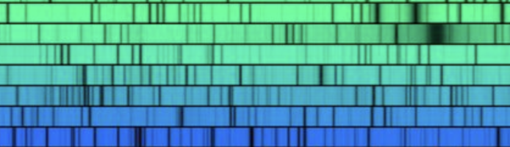

# highres-powerspectrum

Can we create a high resolution _power_ spectrum for the Sun, spanning seconds to centuries? Akin to the classic [solar spectrum from 296 to 1300 nm](https://noirlab.edu/public/images/noao-sun/)
